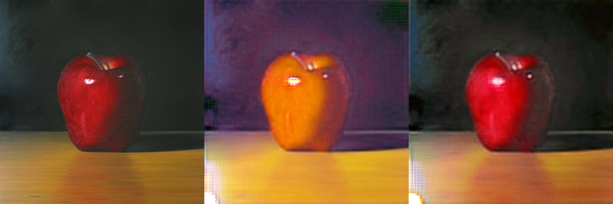
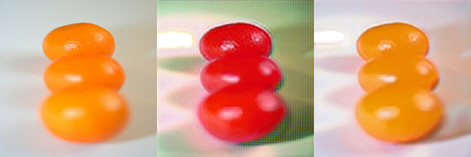
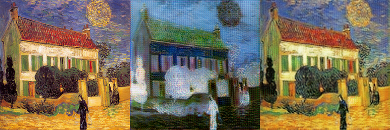
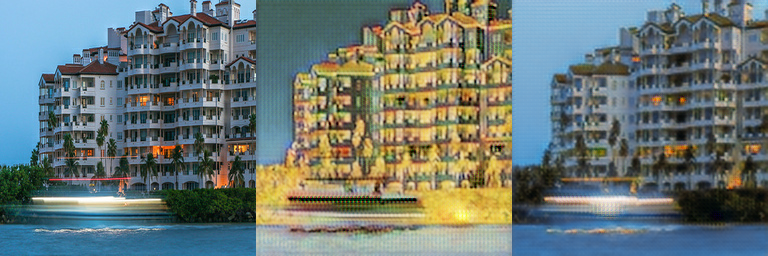
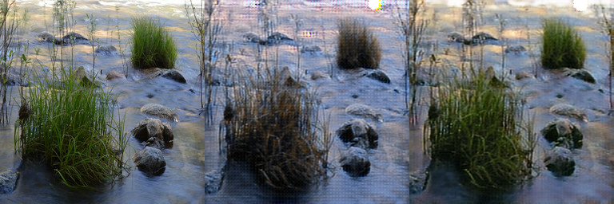
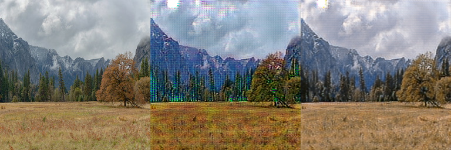

## CycleGAN-TensorFlow
* Tensorflow implementation of CycleGAN in the paper "Unpaired Image-to-Image Translation
using Cycle-Consistent Adversarial Networks" [[Paper]](https://arxiv.org/abs/1703.10593)
* Borrowed code and ideas from junyanz's pytorch-CycleGAN-and-pix2pix: https://github.com/junyanz/pytorch-CycleGAN-and-pix2pix.

## Install Required Packages
First ensure that you have installed the following required packages:
* TensorFlow1.4.0 ([instructions](https://www.tensorflow.org/install/)). Maybe other version is ok.
* Opencv ([instructions](https://github.com/opencv/opencv)). Here is opencv-2.4.9.

See requirements.txt for details.

## More Qualitative results
The datasets used in experiment is apple2orange, vangogh2photo and summer_winter, you can utilize other datasets for style transform using this codes. If so, you should change the training datasets. Here is the training results.

### apple <-> orange

| apple orange apple |
|--------------------|

<center></center>

| orange apple  orange |

<center></center>

### vangogh <-> photo

| vangogh photo vangogh |

<center></center>

| photo vangogh photo |

<center></center> 

### summer <-> winter

| summer winter summer |

<center></center> 

| winter summer winter |

<center></center> 

## Datasets
* In the implementation of the CycleGAN, there are some datasets. Forexample, ae_photos, apple2orange, vangogh2photo and so on.
* Run the **download_dataset.sh** to download these datasets, you can put all the datasets in the datasets folder.
* Run the **scripts/build_tfrecords.py** to generate training data, data format is tfrecords. In the process of generating TFRecords file, it will generate two TFRecord files, one is the trainA, the other is trainB. When training CycleGAN, all the training data are converted to BGR images and resized to 256x256.

## Training a Model
* Run the following script to train the model, in the process of training, will save the training images every 500 steps. See the **model/cyclegan.py** for details.
```shell
sh train.sh
```
You can change the arguments in train.sh depend on your machine config.
* Run the following script to test the trained model. The test.sh will transform the datasets.
```shell
sh test.sh
```
The script will load the trained CycleGAN model to generate the transformed images. You could change the arguments in test.sh depend on your machine config.

## Downloading data/trained model
* Run the **download_dataset.sh** to download these datasets, see the **download_dataset.sh** for details.
* Pretrained model: [download](). 

## Discussion
* When use vangogh2photo dataset as the training data, you will see the result from vangogh to photo is not good. I guess it relate to the vangogh dataset is too smalle, the vangogh dataset has only 400 images. So, in the process of training vangogh2photo, the network with vangogh2photo is not trained well.
* The testing phase is also not good when using apple2orange testing data, maybe is the problem of save images.